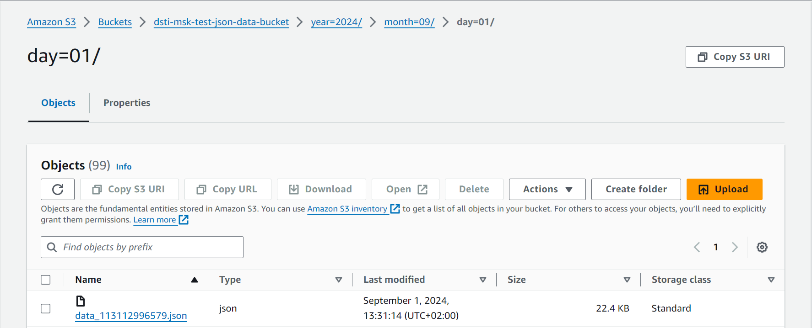
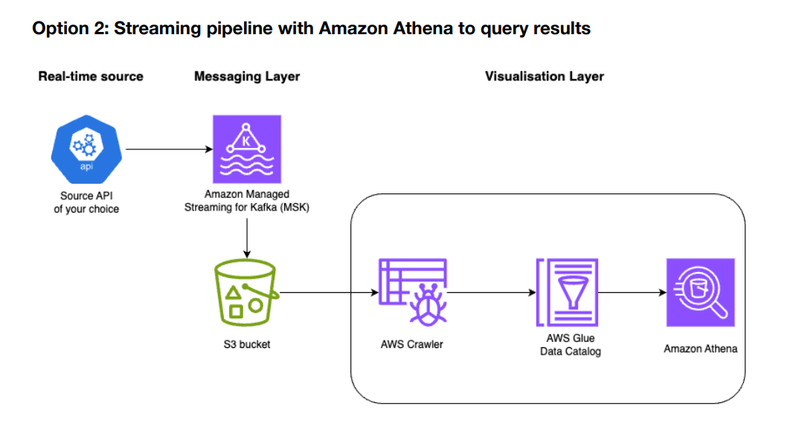

# Option 2 - Streaming pipeline with Amazon Athena to query results
## Description

The project does data ingestion in streaming from Sky-scrapper API.

It requests lists of flights in a specific route (Example: London -> New York City on September 10th) 

**_Tech Stack:_**
- **Source API:** [Air Scraper API](https://rapidapi.com/apiheya/api/sky-scrapper) 
- **Data Producer:** Python Script running as a cron job every minute on an EC2 instance
- **Message broker:** Amazon MSK
- **Data Consumer:** Python Script continuously consuming kafka topic, running on an EC2 instance
- **Persistence layer:** S3 Bucket where data is partitioned by year, month, day
- **Visualization layer:** AWS Glue and AWS Athena 
- **Deployment Automation:** IaC with Terraform

## Prerequisites

- [Terraform](https://www.terraform.io/downloads.html)
- [AWS CLI](https://docs.aws.amazon.com/cli/latest/userguide/cli-chap-install.html)
- [AWS Account](https://aws.amazon.com/premiumsupport/knowledge-center/create-and-activate-aws-account/)

## Get your API Key
Subscribe to the [Air Scraper API](https://rapidapi.com/apiheya/api/sky-scrapper) Free Plan and get 500 requests / month

Select any `Endpoint` -> Select `App` Tab -> Copy the value under `X-RapidAPI-Key`

## Deploying the infrastructure

Locate yourself under the `terraform` directory

Place your API key in `dev.auto.tfvars` 

The variable `global_prefix` is used to prefix all the resources that will be created. This is useful if you want to fastly identified the resources created for this specific use case.

You can change the value of this variable in the `variables.tf` file.

Run the following commands:

```bash
aws configure  # enter your AWS credentials

terraform init
terraform plan  # this is optional, it will show you what will be deployed - check that 23 resources will be created
terraform apply
```

It will take around `35 minutes` to complete the deployment. You will see the following output:

```bash
Apply complete! Resources: 34 added, 0 changed, 0 destroyed.

Outputs:

execute_this_to_access_the_bastion_host = "ssh ec2-user@x.xxx.xxx.xxx -i cert.pem"
execute_this_to_access_the_ec2_data_producer = "ssh ec2-user@x.xxx.xxx.xxx -i cert.pem"
execute_this_to_access_the_kafka_consumer = "ssh ec2-user@x.xxx.xxx.xxx -i cert.pem"
```

A new file under your terraform folder, `cert.pem`, should be created. This is the private key that you need
to use to access the bastion host, data producer and kafka consumer instances.


## Testing the Kafka Cluster

Connect to the bastion host and run the following commands

```bash
# Check your bootstrap servers
more bootstrap-servers

# Check the correct creation of your topic: you should see flight-kafka-topic (defined in variables.tf)
kafka-topics.sh --list --bootstrap-server $(cat bootstrap-servers)

# Consume messages through console: you should see a new message everytime the producer runs the cron job (every minute)
kafka-console-consumer.sh --bootstrap-server $(cat bootstrap-servers) --topic flight-kafka-topic

Outputs: 

[ec2-user@ip-10-0-4-252 ~]$ kafka-topics.sh --list --bootstrap-server $(cat bootstrap-servers)
__amazon_msk_canary
__consumer_offsets
flight-kafka-topic
[ec2-user@ip-10-0-4-252 ~]$ kafka-console-consumer.sh  --bootstrap-server $(cat bootstrap-servers) --topic flight-kafka-topic
{"message":"You have exceeded the MONTHLY quota for Requests on your current plan, BASIC. Upgrade your plan at https:\/\/rapidapi.com\/apiheya\/api\/sky-scrapper"}
{"message":"You have exceeded the MONTHLY quota for Requests on your current plan, BASIC. Upgrade your plan at https:\/\/rapidapi.com\/apiheya\/api\/sky-scrapper"}

```
## Testing the Data Producer

Connect to the data producer instance wait the first scheduled job to run:

```bash
# Check the data producer log file generated by the python script in <CLONE_DIR>/code/producer/data_producer.py
tail -f data_producer.log

Outputs:

[ec2-user@ip-10-0-5-74 ~]$ ls
data_producer.log  flight-data-pipeline
[ec2-user@ip-10-0-5-74 ~]$ tail -f data_producer.log 
-- Data is read successfully from API 2024-09-01 11:36:01.521448
--- Sent message to Kafka topic 'flight-kafka-topic'
-- Data is read successfully from API 2024-09-01 11:37:02.107995
--- Sent message to Kafka topic 'flight-kafka-topic'

# Temporarily stop the ingestion by stopping crond service
sudo service crond stop

# Start the crond service again
sudo service crond start
```

## Testing the Kafka Consumer

Connect to the kafka consumer instance wait for the github repo to be pulled and run the following command:

```bash
# Check kafka consumer log file
tail -f kafka_consumer.log
```

Debug the consumer:
```bash
# Find the process running the consumer script 
ps aux | grep kafka_to_s3_consumer.py
# Kill the process
sudo kill <PID>
# Start the consumer again
nohup python3 $CLONE_DIR/code/consumer/kafka_to_s3_consumer.py $BOOTSTRAP_SERVERS $SECURITY_PROTOCOL $TOPIC_NAME  $S3_BUCKET_NAME >> /home/ec2-user/kafka_consumer.log 2>&1 &
```

Check the s3 output bucket on your account console:


## Destroying the infrastructure

Once you are done with the testing, you can destroy the infrastructure by running the following command:

```bash
# Delete the content of the output S3 bucket
aws s3 rm s3://<your-global-prefix-json-data-bucket> --recursive

# Delete all resources
terraform destroy
```

## Design
Provide a diagram of your solution, it can be the same one as in the pdf or one you've done yourself. Explain the diagram.


Data Pipeline workflow:

- The data producer script deployed on an EC2 instance (public subnet) requests the data from the Sky-scrapper API
- The data producer publishes the responses into a kafka topic
- The kafka consumer script deployed on a separate EC2 instance (public subnet) subscribes to the kakfa topic and writes back the responses to an S3 bucket.

- AWS Crawler periodically scans the S3 bucket where the data is being stored, infers the schema of the stored data and creates/updates the metadata in the AWS Glue Data Catalog.
- AWS Glue jobs (ETL Jobs) can be configured to run based on triggers (like the completion of the crawler)
- The processed data can be stored back in another S3 bucket or in the same bucket but within a different directory or partition.
- Amazon Athena is used to query the data stored in the S3 bucket.
## Developer Guide
If I was to continue as a developer with the work you've just done, which things are essential for me to know in order to be able to do so?
Can you provide with step-by-step assistance of what you've done so far with detailed screenshots? If something is not working as it should, this a good place to state that as well.
### Modify the data ingestion schedule
With the current configuration the data producer sends a message each minute.

We are using a cron job to run the `data_producer.py` script, the minimum time between two executions is 1 minute.

If you want to modify this frequency (to each 5 mins for example) there are two options: 

**Options 1: Modify and re-deploy the data_producer instance**

Open `data_producer_user_data.sh` and modify the following command:
```bash
(crontab -l 2>/dev/null; echo "*/5 * * * * /usr/bin/python3 "${CLONE_DIR}"/code/producer/data_producer.py \"${BOOTSTRAP_SERVERS}\" \"${SECURITY_PROTOCOL}\" \"${SKYSCANNER_API_KEY}\" \"${TOPIC_NAME}\"  >> /home/ec2-user/data_producer.log 2>&1") | crontab -

``` 
On your local terminal:
```bash
# Taint the data_producer instance
terraform taint aws_instance.data_producer

# Init and apply changes
terraform init && terraform apply

```
**Options 2: Modify the cron job without re-deploying the data producer instance**

SSH to the data producer instance

```bash
# List current cron jobs and identify the entry you want to  modify
crontab -l

# Edit the cron jobs
crontab -e

# Modify the frequency for example:
(crontab -l 2>/dev/null; echo "*/5 * * * * /usr/bin/python3 "${CLONE_DIR}"/code/producer/data_producer.py \"${BOOTSTRAP_SERVERS}\" \"${SECURITY_PROTOCOL}\" \"${SKYSCANNER_API_KEY}\" \"${TOPIC_NAME}\"  >> /home/ec2-user/data_producer.log 2>&1") | crontab -

# Save and exit: the changes will be applied automatically
```

If you want to run the ingestion more frequently than 1 minute (every 15 seconds for example)
```bash
# Set multiple cron entries
* * * * * /usr/bin/python3 /home/ec2-user/data_producer.py <...>
* * * * * sleep 15; /usr/bin/python3 /home/ec2-user/data_producer.py <...>
* * * * * sleep 30; /usr/bin/python3 /home/ec2-user/data_producer.py <...>
* * * * * sleep 45; /usr/bin/python3 /home/ec2-user/data_producer.py <...>
```
Or use a loop inside the script.

### Improve CI/CD
The data producer and the kafka consumer scripts are both under the `/code` folder.
The whole github repository is cloned when setting up the instances, which is not a good idea! (Totally against DevOps Best practices)

**Solution:**

Ideally the code should be packaged (two packages for consumer code and producer code) 

Push into an artifact repository ([AWS CodeArtifact](https://aws.amazon.com/fr/codeartifact/), [Nexus](https://www.sonatype.com/products/integrations#tool-integrations) ...) 

Leverage semantic release using GitHub Actions and continuous deployment.

###  Improve Security and Networking
Both Producer and Consumer instances are deployed in public subnets, exposing the system to potential threats and data leaks.

The Producer instance should be in a private subnet, connected to a NAT Gateway or a NAT instance to allow requesting the external API.

Both the Producer and Consumer should fetch the software packages from CodeArtifact through a **VPC Endpoint**

The consumer should write the output json files into the S3 bucket through a **VPC Endpoint**

### Reduce costs
If your use case requires lightweight data processing and a larger duration between messages, 
you should consider using a serverless architecture (Lambda functions instead of EC2 instances) for reduced costs and less management overhead.

### Improve terraform configuration
Split the main.tf file into several modules.

# Author
    Mohamed Hamiche
    Graduate Data Engineer
    DSTI School of Engineering
    mohamed.hamiche@edu.dsti.institute

